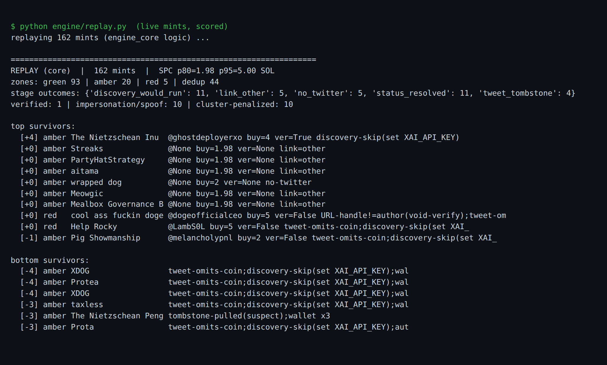
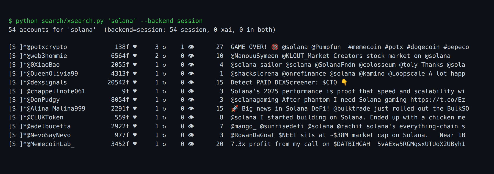

# API-God

A keyless signal engine for Solana memecoins, and the X-search tooling it grew out of.

API-God watches every new coin the moment it mints. It finds the X account behind the coin, checks whether that account is telling the truth, and scores it. It pays for no API. Every source it reads is public.

## What is in here

Three parts.

- `engine/` is the product. A live pipeline from the mint firehose to a scored, verified signal. Plus a learning loop that checks later what happened to each coin.
- `search/` is `xsearch`, a tool that finds who is posting about a topic or coin on X. The engine can call it for corroboration.
- `legacy/` is the retired first version: a browser that rode your logged-in sessions and captured traffic from any site. Kept for reference.

## The idea

X sells search behind paid developer tiers. A coin's social proof looks like it should cost money to verify. It does not. The data is already moving over public channels:

- New pump.fun mints arrive in real time on a public PumpPortal websocket. No key.
- Each mint carries a link to its metadata JSON, and that JSON holds the project's X link. No key.
- A specific tweet resolves to full JSON through `cdn.syndication.twimg.com`, the endpoint that draws embedded tweet cards. No key, no cookie.

So the signal is free to read. That is the easy part. The hard part is why the engine exists. The coin's creator writes its own social link. The link is a claim. Impersonation is the norm here. The engine's real job is verification, not fetching.

## How the engine works

A single coin moves through the pipeline like this.

1. **Source.** One websocket to PumpPortal streams every new mint. Exactly one connection, and it backs off on drops. Reconnect spam earns an IP ban.
2. **Zone.** The creator's own first buy is ranked against a rolling window of recent buys. Ordinary buys are green and dropped. Unusually large buys are amber or red and worth the work. This is how the engine ignores the noise and spends effort only where real money went in.
3. **Enrich.** The engine fetches the mint's metadata through a pool of IPFS gateways. It reads the coin's claimed `twitter` link and sorts it into one of: a specific tweet, a bare profile, a search, a community.
4. **Resolve.** If the link points at a specific tweet, the engine pulls that tweet's full JSON from the syndication CDN.
5. **Verify.** Two checks, both independent of the coin. Does the tweet's real author match the handle in the claimed link? Does the tweet's text mention the coin's ticker or contract address? A handle mismatch voids the verification outright. A coin cannot earn trust by pointing at someone else's words.
6. **Discover.** Optionally, who else is posting this coin's contract address, and are they independent of the creator? Independent posters are the one thing a scammer cannot fake cheaply.
7. **Penalize clusters.** If one wallet or one account is behind a batch of coins, every coin in the batch is marked down. Serial farming is the strongest predictor of a bad outcome.
8. **Score and record.** The engine gives the coin a number and a written reason, and logs the result for the learning loop.

Here is a real run over coins captured live from the firehose:



Read it as a story. The one coin that verified clean rose to the top. The coin claiming `@dogeofficialceo` lost its verification. Someone else wrote the tweet it linked. Ten of the resolved coins linked a tweet that was either not theirs or never mentioned the coin. Coins from repeated wallets sank to the bottom. The engine spent nothing. Every `discovery-skip` is the paid stage switching itself off with no key set.

## The learning loop

A score is a guess until you check it. `outcomes.py` records every scored coin, then comes back at T+6h, T+24h, and T+72h to ask the chain what happened. It reads last on-chain activity and holder concentration from the free Solana RPC, and price, liquidity, and volume from the free DexScreener API. From those it labels each coin DEAD, ALIVE, FLAT, or MOON. The calibrator then reads that labeled history and learns which features predicted a good outcome. It caps how far any weight can move in one cycle and refuses to learn from too little data. On synthetic data it recovers that serial farming hurts and independent corroboration helps.

## xsearch

`xsearch` answers one question: who is talking about this topic or coin on X. It has two backends.

- `session` is free. It rides your saved X login and reads X's own `SearchTimeline` response off the wire as the page loads. It does not scrape the painted page and it does not call the paid API. It reads the exact JSON the web app already receives. That JSON carries follower count, blue status, views, and quote count.
- `xai` is clean. xAI's `x_search` finds candidate posts, and the same free syndication CDN turns each into a structured record. About half a cent per search, no account risk.
- `both` runs the two together and tags each account by who found it. An account found by both backends independently is corroborated.



## Layout

```
engine/   live pipeline, replay harness, outcome loop, shared scoring core, adversarial tests
search/   xsearch (session + xai backends)
legacy/   retired Node browser-interception layer
docs/     design specs and these images
```

## Install

```
python -m venv .venv && source .venv/bin/activate
pip install -r engine/requirements.txt     # engine + outcome loop
pip install -r search/requirements.txt     # xsearch
playwright install chromium                 # for the session backend and the search tool
```

## Use

```
# engine
python engine/live.py                  # stream the firehose and score live (runs a time budget, then a summary)
python engine/replay.py mints.jsonl    # re-score a captured run offline
python engine/outcomes.py run          # check and label scored coins past their window
python engine/outcomes.py stats        # does a higher score predict a better outcome?
python engine/stress.py                # adversarial tests of the scoring core

# search
python search/xsearch.py --login                      # one-time: save your X session
python search/xsearch.py "solana" --backend session   # who is posting about it
python search/xsearch.py '$GIGA' --backend both --json # corroborated, as JSONL
```

## Design notes

- **Keyless by default.** The live engine needs no API key and runs no browser. The paid xAI stage and the session-search stage are both opt-in.
- **Verification is the product.** The pipeline treats every social link as a lie until the tweet proves otherwise.
- **The session path is bannable**, so it stays off the engine's hot path. Set `DISCOVERY_SESSION=1` to use it for backtests. Never point it at the live firehose.

## License

MIT. Nicholas Kloster.
